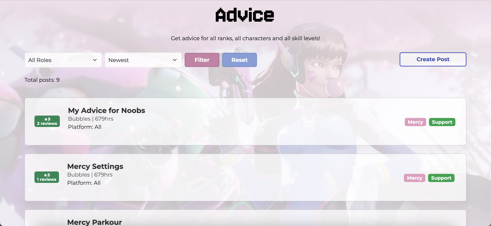

# 🐰 Nerf This
Welcome to **Nerf This**! Whether you're a seasoned Overwatch hero looking to share your knowledge or a new recruit seeking guidance, this website is your go-to payload for all things Overwatch.

---

## ⏳ About This Project
Hi there! This website was my entry point into the world of Laravel, so while it may not use the full power of the framework, it still packs a punch with some cool features. This Overwatch-themed website is all about sharing advice and seeking help to enhance your gameplay and level up your skills!
With two types of posts, players can share **Advice** or request **Assistance**, specifying the gaming platform, role, and hero.  

---

## 🎮 Features

### 🐉 **Users**
User data is saved in cookies to keep you "logged in." Create a user to start posting and commenting. Your in-game hours will proudly display your experience to others.

────────────────────────────────────────────

### 🕷️ **Home Page**
Explore all posts sorted by hero roles — Tank, Damage, and Support. It's your one-stop hub for advice and assistance! 

────────────────────────────────────────────

### 🚀 **Posts**
All players can create two types of posts:

- **Advice Posts** for sharing strategies and insights. Help the Overwatch community step up their game! 

- **Assistance Posts:** for those needing help climbing the ranks or mastering their favourite hero. Post your query and let the community support you!

Posts are neatly sorted onto their respective pages.

────────────────────────────────────────────

### 🏹 **Comments**
Players can:
- **Rate advice posts** to help highlight the best tips.  
- **Comment on assistance posts** to lend a hand to those in need.  

But remember: only **one comment per user** per post. Play fair!

────────────────────────────────────────────

### 🦊 **Gamers**
Gamers are anyone who create advice posts. Your advice rating determines your **Gamer Board ranking** — the higher the rating, the more valuable your insights are to the community!

────────────────────────────────────────────

### 🛡️ **Preventing Fake Reviews**
To keep things honest, we've implemented measures to detect and stop fake reviews:  
1. If the last five reviews are for the same user.  
2. If 75% of a user’s reviews come from the same gamer (checked after 10 reviews).  
3. If a gamer receives 20 reviews rated four or five stars in under a minute.  

**Actions Taken:**  
- For behaviors 1 and 2, the user is **banned from commenting**, and their reviews are removed.  
- For behavior 3, all the gamer’s posts will have **locked comments** to prevent further misuse.  

Don't worry, you can still browse the website even if you're banned from commenting!  

---

## 🛠️ **Tech Stack**
- **Backend:** Laravel (PHP)  
- **Frontend:** Blade templates, CSS, HTML  
- **Database:** MySQL  

---

## 🪽 Final Notes
Thanks for stopping by and exploring **Nerf This**! This was my first venture into web development, and while the code is simple, it's been an enjoyable learning experience. I hope you have as much fun using this site as I had building it!